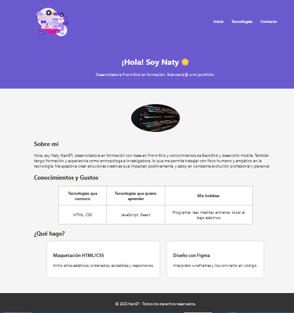

# SegundaEntregaFrontEnd
# Portfolio Personal - Naty (Itan87)

¡Bienvenid@! Este es mi portfolio personal como parte de mi formación en desarrollo FrontEnd.

## 🚀 Sobre el Proyecto

Este proyecto es una continuación revisisada de mi primer portfolio, mejorando la estructura, el diseño y la interactividad. Mi objetivo principal es crear una plataforma para mostrar mis capacidades como desarrolladora Front-End en formación, con una base sólida en HTML, CSS y JS, con aspiraciones en Back-End y desarrollo móvil.

## ✨ Características Destacadas

* **Diseño Responsive:** Adaptado a diferentes tamaños de pantalla utilizando Media Queries y Flexbox para una experiencia de usuario óptima.
* **Navegación Intuitiva:** Un menú de navegación claro y responsivo con un "menú hamburguesa" para dispositivos móviles.
* **Sección "Sobre mí":** Una breve descripción personal y profesional.
* **Sección "Qué hago":** Presentación de los servicios y habilidades clave en Front-End (Maquetación HTML/CSS, Diseño con Figma).
* **Sección "Tecnologías":** Una página dedicada a las tecnologías con las que he trabajado o estoy aprendiendo (Front-End, Back-End, Mobile, Blockchain), incluyendo descripciones y enlaces a proyectos.
* **Formulario de Contacto:** Un formulario sencillo para facilitar la comunicación.
* **Efectos Visuales:** Transiciones y efectos hover en elementos clave para mejorar la interactividad y la experiencia de usuario.
* **Optimización:** Código limpio, bien indentado y comentado para facilitar su lectura y mantenimiento.

## 🛠 Tecnologías Utilizadas

* **HTML5:** Estructura semántica del contenido.
* **CSS3:** Estilos y diseño visual, incluyendo Flexbox y Media Queries para la responsividad.
* **JavaScript:** Pequeñas interacciones (ej. menú hamburguesa).
* **Font Awesome:** Para los iconos.

## 📂 Estructura del Proyecto

.
├── css/
│   └── style.css
├── img/
│   ├── img-representativa.jpg
│   ├── logo.png
│   ├── frontend.png
│   ├── java.png
│   ├── mobile.png
│   ├── ethereum.png
│   └── screenshot-web.png 
├── index.html
├── tecnologias.html
├── contacto.html
└── README.md

#Imagen

